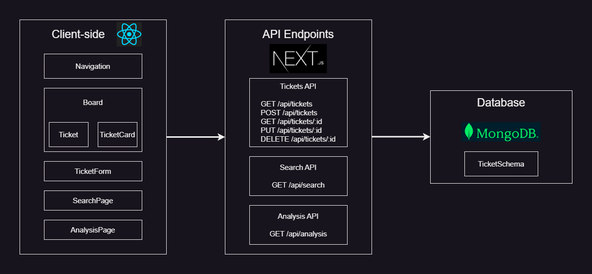
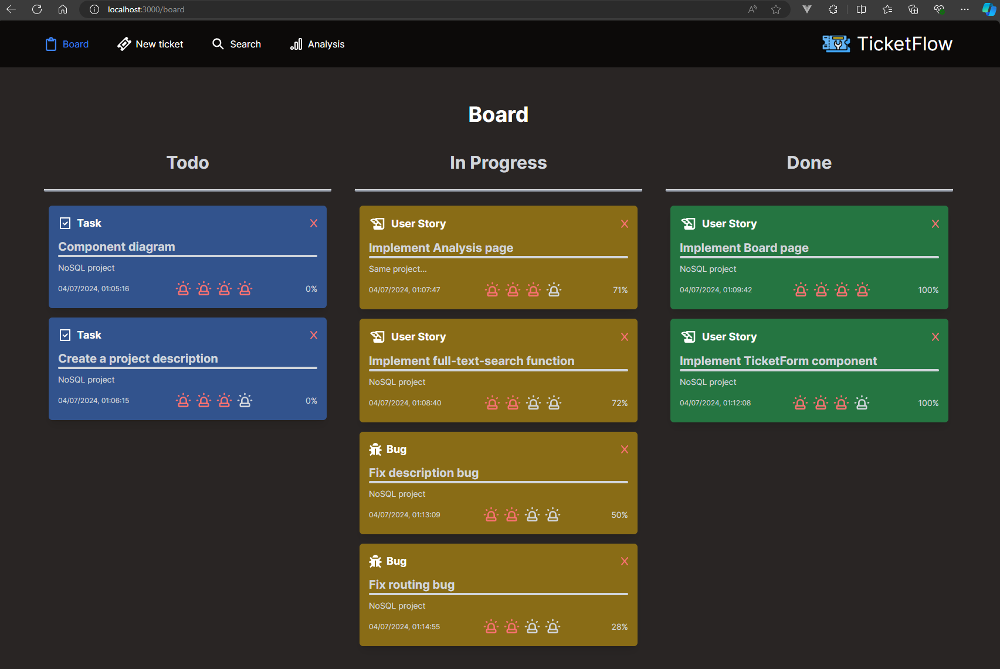
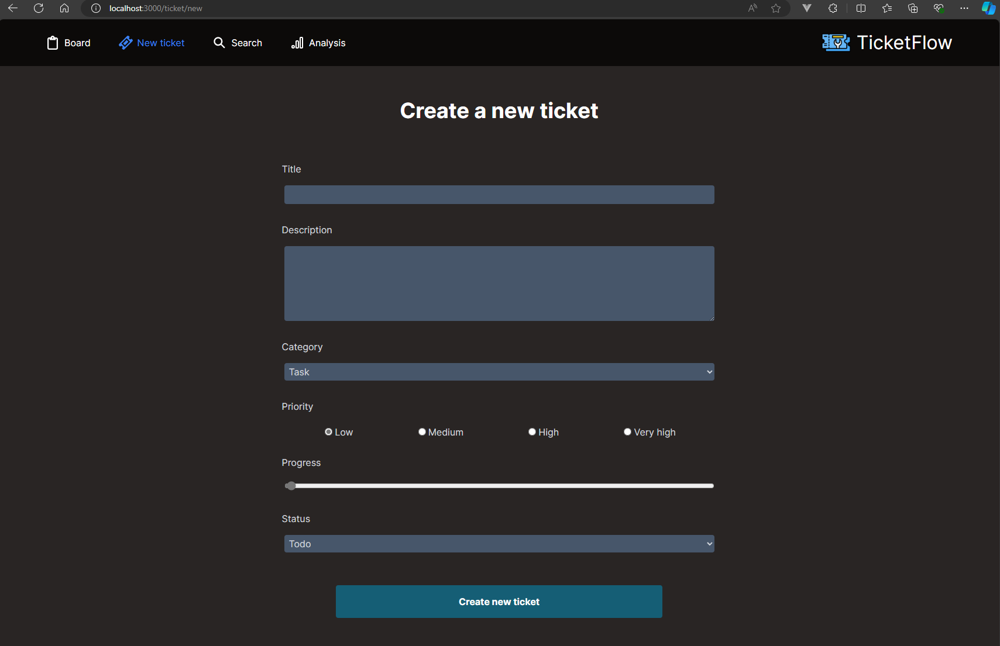
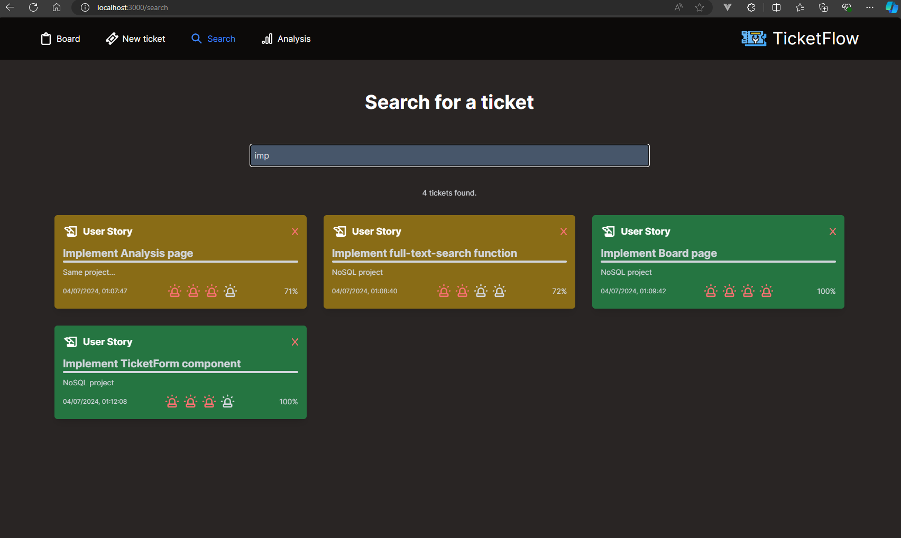
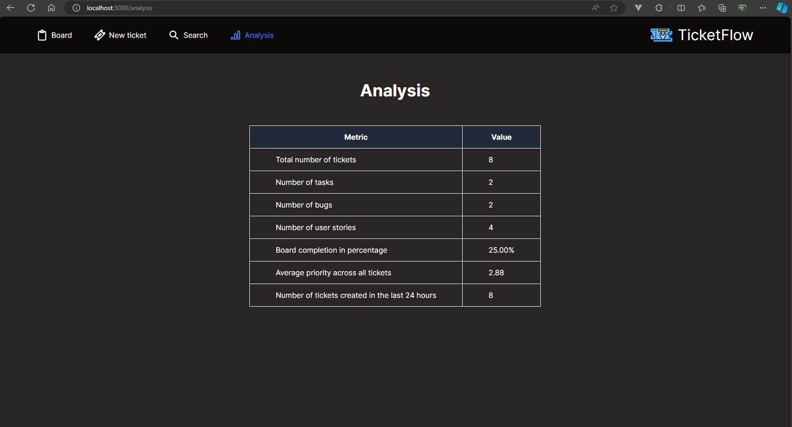
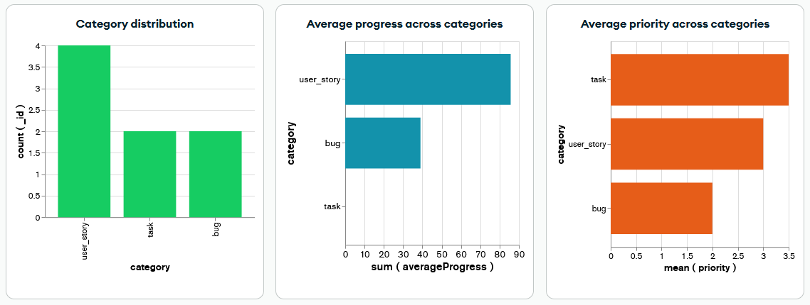

# Ticket Flow

## 1. Projektauftrag

### Ziel

Das Ziel dieses Projekts ist es, eine webbasierte Anwendung zu entwickeln, die das Management von IT-Tickets ermöglicht. Diese Anwendung soll Funktionen zur Erstellung, Aktualisierung, Suche und Analyse von Tickets bieten. Die Ergebnisse dieses Projekts umfassen eine funktionale Webanwendung, die ein intuitives Dashboard, eine Ticket-Formularseite, eine Suchseite und eine Analyseseite beinhaltet. Die Anwendung wird eine MongoDB-Datenbank verwenden, um Ticketdaten zu speichern und zu verwalten.

### Projektauftrag

Im Rahmen dieses Projekts soll eine Webanwendung entwickelt werden, die es Nutzern ermöglicht, Tickets zu erstellen und zu aktualisieren, nach Tickets zu suchen und Analysen über die Tickets zu betrachten. Die Anwendung soll ein benutzerfreundliches Interface und robuste Backend-APIs bieten, um eine effiziente Ticketverwaltung zu gewährleisten. Die Hauptfunktionen umfassen die Anzeige von Tickets in einem übersichtlichen Dashboard, die Möglichkeit zur detaillierten Suche nach spezifischen Tickets und die Bereitstellung von Analysewerkzeugen zur Auswertung der Ticketdaten. Die Anwendung wird auf einer modernen Technologie-Stack aufgebaut, einschliesslich React für das Frontend, Next.js für das Server-Side Rendering und Routing, sowie MongoDB für die Datenbankverwaltung. Durch die Verwendung von Tailwind CSS soll eine ansprechende und responsive Benutzeroberfläche sichergestellt werden.

### Erwartete Schwierigkeiten

Probleme können bei der Implementierung der API-Endpunkte und der Datenbankinteraktionen auftreten. Unsicherheiten bestehen in der Handhabung von Transaktionen und Rollbacks bei fehlgeschlagenen Datenbankoperationen. Die kompliziertesten Arbeiten umfassen die Synchronisation der Client-seitigen und Server-seitigen Zustände sowie die effiziente Umsetzung der Such- und Analysefunktionen.

### Techniken, Frameworks und Tools

Für dieses Projekt sollen die folgenden Arbeitsmittel und Programmiersprachen eingesetzt werden:

- **Frontend**: React, Next.js
- **Backend**: Node.js (Laufzeitumgebung, auf der Next.js ausgeführt wird), Next.js (Framework, das das Routing, die serverseitige Logik und die API-Routen verwaltet)
- **Datenbank**: MongoDB, Mongoose
- **Styling**: Tailwind CSS
- **Tools**: npm (Abhängigkeiten zu verwalten und Pakete zu installieren), open-cli (URL direkt aus dem Terminal zu öffnen), npm-run-all (mehrere npm-Skripte parallel oder nacheinander auszuführen)

### Bemerkungen

- **Links**: [Next.js Dokumentation](https://nextjs.org/docs), [MongoDB Dokumentation](https://docs.mongodb.com/), [React Dokumentation](https://react.dev/reference/react)

## 2. User Stories

### Benutzerstory 1: Ticket erstellen

**Beschreibung:** Als ein Benutzer möchte ich ein neues Ticket erstellen damit ich Aufgaben oder Probleme verfolgen kann, die bearbeitet werden müssen.

**Akzeptanzkriterien:**

- Das Formular "Neues Ticket erstellen" sollte Felder für Titel, Beschreibung, Kategorie, Priorität, Fortschritt und Status enthalten.
- Der Benutzer sollte eine Kategorie aus einer vordefinierten Liste auswählen können (z.B. Aufgabe, User Story).
- Der Benutzer sollte die Priorität des Tickets festlegen können (Niedrig, Mittel, Hoch, Sehr hoch).
- Der Benutzer sollte den Fortschritt des Tickets mithilfe eines Schiebereglers einstellen können.
- Der Benutzer sollte den Status des Tickets festlegen können (Todo, In Bearbeitung, Erledigt).
- Der Benutzer sollte nach erfolgreicher Ticketerstellung eine Bestätigungsmeldung erhalten.

### Benutzerstory 2: Tickets auf dem Board anzeigen

**Beschreibung:** Als ein Benutzer möchte ich alle Tickets auf einem Board anzeigen lassen damit ich den Status jedes Tickets auf einen Blick sehen kann.

**Akzeptanzkriterien:**

- Das Board sollte drei Spalten haben: Todo, In Bearbeitung und Erledigt.
- Tickets sollten unter der entsprechenden Spalte basierend auf ihrem Status angezeigt werden.
- Jedes Ticket sollte den Titel, die Beschreibung, die Priorität, den Fortschritt und das Erstellungsdatum anzeigen.
- Der Benutzer sollte die Priorität und den Fortschritt jedes Tickets visuell erkennen können.

### Benutzerstory 3: Ticketstatus aktualisieren

**Beschreibung:** Als ein Benutzer möchte ich den Status eines Tickets aktualisieren damit ich den Fortschritt meiner Aufgaben verfolgen kann.

**Akzeptanzkriterien:**

- Der Benutzer sollte auf ein bestehendes Ticket klicken können und zur Seite "Ticket aktualisieren" weitergeleitet werden.
- Auf der Seite "Ticket aktualisieren" sollte der Benutzer die Ticketdetails neu definieren können.
- Der Benutzer sollte nach erfolgreicher Aktualisierung des Ticketstatus eine Bestätigungsmeldung erhalten.

### Benutzerstory 4: Nach Tickets suchen

**Beschreibung:** Als ein Benutzer möchte ich nach einem bestimmten Ticket suchen damit ich es schnell finden und seine Details überprüfen kann.

**Akzeptanzkriterien:**

- Der Benutzer sollte einen Suchbegriff in die Suchleiste eingeben können.
- Die Suchergebnisse sollten Tickets anzeigen, die dem Suchbegriff entsprechen.
- Jedes Ergebnis sollte den Titel, die Beschreibung und das Erstellungsdatum des Tickets anzeigen.
- Der Benutzer sollte auf ein Ticket in den Suchergebnissen klicken können, um dessen vollständige Details anzuzeigen.

### Benutzerstory 5: Ticketdaten analysieren

**Beschreibung:** Als ein Benutzer möchte ich die Ticketdaten analysieren damit ich den gesamten Fortschritt und die Leistung verstehen kann.

**Akzeptanzkriterien:**

- Die Analyse-Seite sollte Metriken wie die Gesamtanzahl der Tickets, die Anzahl der Aufgaben, die Anzahl der Bugs, die Anzahl der User Stories, den Prozentsatz der Board-Fertigstellung, die durchschnittliche Priorität und die Anzahl der in den letzten 24 Stunden erstellten Tickets anzeigen.
- Jede Metrik sollte in einem klaren und leicht lesbaren Format dargestellt werden.
- Der Benutzer sollte von der Hauptnavigationsleiste auf die Analyse-Seite zugreifen können.

## 3. Komponentendiagramm

### Client-seitig:

- Die Navigation-Komponente verwaltet Links zu verschiedenen Seiten.
- Die Dashboard-Komponente zeigt Tickets auf dem Board an und verwendet dabei die TicketCard-Komponente.
- Die TicketForm-Komponente wird zum Erstellen und Aktualisieren von Tickets verwendet.
- Die SearchPage-Komponente ermöglicht die Suche nach Tickets.
- Die AnalysisPage-Komponente zeigt Analysen zu den Tickets an.

### API-Endpunkte:

- **Tickets API**: Verwaltet CRUD-Operationen für Tickets.
- **Search API**: Verwaltet die Suche nach Tickets.
- **Analysis API**: Stellt Analysedaten zu den Tickets bereit.

### Datenbank:

- **MongoDB mit Ticket-Schema**: Speichert Ticketinformationen wie Titel, Beschreibung, Priorität, Status usw.

## 4. Projektbeschreibung

Das Projekt "Ticket Flow" zielt darauf ab, eine webbasierte Anwendung zur Verwaltung von IT-Tickets bereitzustellen. Diese Anwendung ermöglicht es Nutzern, Tickets zu erstellen, zu aktualisieren, nach ihnen zu suchen und Analysen darüber durchzuführen.

### Funktionen

Die entwickelte Webanwendung bietet Nutzern folgende Möglichkeiten:

- Tickets zu erstellen und zu aktualisieren.
- Nach Tickets zu suchen.
- Analysen über die Tickets durchzuführen.
- Ein übersichtliches Dashboard anzuzeigen, das Tickets je nach ihrem Status in verschiedenen Spalten darstellt.

### Applikation im Browser

### Reporting

